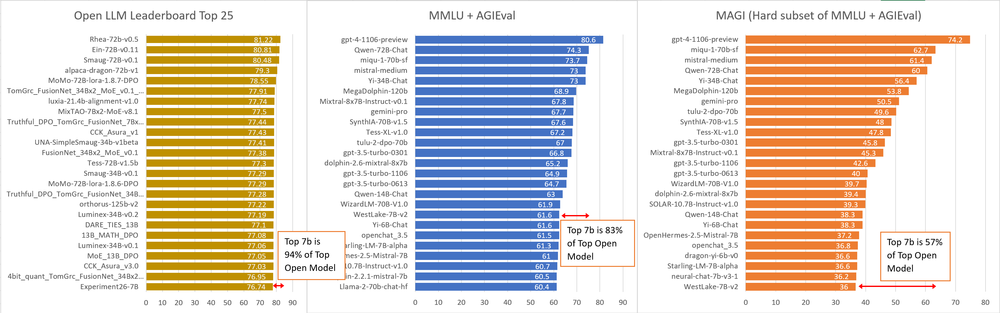

# Creating MAGI: A hard subset of MMLU and AGIEval

## Adding Headroom and Discriminative Power to Existing Benchmarks

[bar charts showing scores between mmlu + agieval (original) baseline, vs MAGI (hard subset of MMLU + agieval)]

### This is going to be a dense post with a lot of methodology details. Here’s the **TL/DR:**

* LLM Benchmarks are running out of headroom, so:
* I created a 5x smaller, hard subset of MMLU + AGIEval
* 4x Increase in discriminative power between the top models compared to full MMLU + AGIEval (measured by std. dev. of top models)
* Tradeoff: A reference model is “burned” and cannot be scored fairly (in this case I used Deepseek-67b as the reference)

You can find the MAGI set here: [https://huggingface.co/datasets/sam-paech/magi_1_0](https://huggingface.co/datasets/sam-paech/magi_1_0)

And use it with this fork of the Eleuther eval harness: [https://github.com/sqrkl/lm-evaluation-harness](https://github.com/sqrkl/lm-evaluation-harness)

MAGI has been added as a metric on the [EQ-Bench leaderboard](https://eqbench.com/).

### Motivations for doing this:

* Benchmarks are increasingly unable to distinguish between top ability models
* Small param models (like 7B) are over-fitting benchmarks and overperforming
* Easier to remix existing benchmarks than create new ones
* Smaller test = better

We need tests that are harder; but a brutally hard test that none of the models can complete is not useful. So we need harder *and* more discriminative tests.

It’s no trivial thing to construct tests that meet these criteria. Fortunately, existing benchmarks benchmarks like MMLU have a *lot* of questions, and some fraction of them can be selected for maximum discriminative power.

### How to select discriminative questions

The idea here is that we want to choose questions that are not merely hard, but discriminative. Models might also score poorly on a question because it’s a bad question (badly written, wrong or misleading). Furthermore, there are entire categories in AGIEval, MMLU & BigBench (3 of the main benchmarks compared in this evaluation) that are too hard for *all* models, and ought to be excluded.

Hard questions: Few or no models might get a question right if it’s too hard. These questions advantage random guessers.

Discriminative questions: Effectively separate high/mid/low ability levels.

There are several ways we can try to model question difficulty & discriminative power. Here’s a few:

1. Rank questions by the average score of all tested models
2. Rank questions by the difference between a high ability reference model’s score and average score
3. Rank questions by discrimination / difficulty as determined by Item Response Theory (IRT) analysis.

Let’s go over these briefly:

### Ranking questions by average score of all test models

This is a simple & obvious approach to modelling question difficulty. It gives a reasonable approximation for difficulty but it doesn’t differentiate between hard vs discriminative, and doesn’t weed out bad questions. This approach gained about **1.5x increase** in discriminative power between top models. I measure this by calculating std. dev. of the top 10 models tested in this evaluation.

### Score Difference Between High Ability Reference Model vs Average

This metric I refer to herein as _Ref-vs-others. _This is a method I tried out on a whim and which turned out to be the most discriminative by a large margin. There is a** significant downside to this approach, which is that you cannot score the reference model fairly on the resulting subset.** This is because we have selected questions that the reference gets correct. If this tradeoff is not suitable for your use case, you can use IRT which doesn’t suffer from this issue but only gives about half the gain in discriminative power.

Ref-vs-others involves choosing a high ability reference model, then ranking each question by:

[reference model score] minus [average of other models’ score].

This approach increased the std. dev. of the top model scores by **4x over baseline**.

Ref-vs-others also neatly sidesteps the problems of approach #1 – favouring too-hard or badly designed questions – since we’re discarding all questions that our reference model got wrong.

For MAGI I used Deepseek-67B as the reference model, because it’s a strong model but not currently widely used for fine-tuning, so 

### Item Response Theory (IRT)

is a widely used and established method in test design which models both the question difficulty and how discriminative the question is for a given ability range. Essentially you feed the model a large number of test results, and it does a lot of computations and figures out coefficients for difficulty and discriminative power for each question.

Using IRT to rank questions yielded a **~2x increase** in std. dev. of the top models over baseline. An advantage of IRT over Ref-vs-others is that it doesn’t use a reference model to determine question difficulty.

So, every option here involves tradeoffs and compromises. We will get into it!

### Creating the discriminative subset:

1. Run the full test sets of various benchmarks on a set of models, recording all answers
2. Pick a strong model to be the reference
3. Order the questions by this metric:

[Reference model score] minus [voter models avg. score]

Where the score is either 0 or 1 depending on whether the model got the question right.

4. Progressively delete questions that score lowest on this metric
5. Recalculate scores using the refined subset.

Applying this heuristic, we are left with a subset that includes questions that the reference model got right but others found difficult.

Here is what the score trends looks like for MMLU + AgiEval, as we progressively delete questions:

>>>>>  gd2md-html alert: inline image link here (to images/image2.png). Store image on your image server and adjust path/filename/extension if necessary.  (<a href="#">Back to top</a>)(<a href="#gdcalert3">Next alert</a>) >>>>> 

### Explanation of the chart:

This is a dense chart with a lot of interesting stuff going on, so let’s break it down.

We’ve ordered the test set by our discrimination metric, which is:

    [Reference model score] minus [voter models avg. score]

In other words: How well the reference model performs on the question relative to average.

We are iteratively deleting chunks of the test set, recalculating scores each time. The x-axis then represents (ostensibly) progressively more discriminative sets of questions. The last point on the x-axis is our final subset of questions.

### Interpretation:

Of immediate interest are the score trends. We can see how the different models respond to the hardest questions. We can see “corrections” which are revealing of the models’ ability to handle really tough questions. Yi-34B for example, which overperforms on MMLU for its parameter size, trends down hard at the end. There is a separation of Miqu and mistral-medium which is also very curious. The 120b MegaDolphin model also uptrends at the end. It’s a bit hard to tell on this chart, but models typically trend in the direction of parameter size, relative to each other, which results in a number of switched places in the rankings.

In this chart we’ve pushed the deletions further than is advisable, to illustrate some interesting movements of the score trends. Deleting this much produces some nasty biases: stronger penalties to the participating models; advantaging guessers; scores below the random baseline. More on that later.

Let’s talk about some evident issues with our method thus far:

* Models are scoring below the random baseline
* Weak guesser models outperforming stronger models
* Voter penalty

### Voter Penalty:

This method (and also IRT) creates a bias against the voter models that were included in the analysis (I call them “voter models” because they effectively vote on which questions are hard). We are deciding which questions to include in the final subset by selecting questions that these models in particular got wrong. This naturally causes the score for voter models to be lower than if they were not included in the analysis.

We can estimate the voter penalty per model by running the whole analysis with each model included vs. excluded and comparing the scores.

This bias can be mitigated by including more (and more diverse) voters in the analysis. We want to choose questions that are generally hard, not ones that are only hard for our voter models specifically.

Here is a chart of the score penalty for being included in the voter pool, vs. number of voters:

>>>>>  gd2md-html alert: inline image link here (to images/image3.png). Store image on your image server and adjust path/filename/extension if necessary.  (<a href="#">Back to top</a>)(<a href="#gdcalert4">Next alert</a>) >>>>> 

With just one voter the score penalty is ~35 pts (out of 100). With 60 voters we have a penalty of 1.6 pts, beyond which we see diminishing returns (and are running out of foundational models to add to the voter pool).

### Choosing voter models:

I aimed to include 3 representative chat or instruct fine-tunes from every major foundational model + param size variant. Choosing more representatives of a given base model would have increased the voter penalty for other fine-tunes of that base model, because they will have similar answering patterns. Choosing fewer representatives per base model increases the average voter penalty. I just followed my nose with this tradeoff; further work could look at optimising the voter model selection.

Ok, so we’ve mitigated the voter penalty to an extent, but issues remain:

1. Voter penalty is still significant (~2 pts) which is not terrible but also not very fair.
2. Many models are scoring below the random baseline of ~25%
3. Random guessers outperform stronger models

### Reducing the voter penalty:

The solution I came up with to reduce the voter penalty was, I think, a little inelegant but functional. The idea is that we re-add previously deleted questions in a targeted way, choosing questions that the voter models got right. This offsets the unfairness of their being discriminated against in the initial voting & deletion process.

Handily, this also mitigates issues 2 & 3 by bringing up the scores of the lower ability models so they are above the random baseline, meaning random guessers are no longer advantaged.

I spent a lot of time experimenting with different ways to pad the test set with previously deleted questions to reduce the voter penalty. The condensed version of which is that I iteratively added random questions that each voter model got right, per model, the number of which was proportional to that model’s voter penalty.

[The footnotes go into more detail about the selection process.]

Here’s a chart of the voter penalties per model before & after offset padding:

>>>>>  gd2md-html alert: inline image link here (to images/image4.png). Store image on your image server and adjust path/filename/extension if necessary.  (<a href="#">Back to top</a>)(<a href="#gdcalert5">Next alert</a>) >>>>> 

These are the score trends with offset padding included:

>>>>>  gd2md-html alert: inline image link here (to images/image5.png). Store image on your image server and adjust path/filename/extension if necessary.  (<a href="#">Back to top</a>)(<a href="#gdcalert6">Next alert</a>) >>>>> 

The purple overlay highlights the increase in spread for the top model scores.

The parameters I optimised for here placed a high importance on discriminative power between the top models. This effectively has squashed the scores of the mid to low ability models into a small range. This tradeoff is fine for my purposes as I wanted the MAGI set primarily to add headroom to the EQ-Bench leaderboard. But if you instead wanted to, for example, retain discriminative power in the mid-low ability range, you can easily do this by tweaking the deletion & padding selection parameters.

### The End Result

The final MAGI set is 3203 questions, a 5x reduction over the original set. It is 4x more discriminative amongst the top models, which represents a steep hill to climb for those aspiring 7b leaderboard optimisers. Not bad!

You can find the MAGI set here: [https://huggingface.co/datasets/sam-paech/magi_1_0](https://huggingface.co/datasets/sam-paech/magi_1_0)

And use it with this fork of the Eleuther eval harness: [https://github.com/sqrkl/lm-evaluation-harness](https://github.com/sqrkl/lm-evaluation-harness)

## Footnotes:

I cut a lot of detail out of the main article; the remainder is for those who are interested or wish to reproduce the method:

### Why does the score trends chart trend up then down?

The initial uptrend happens because our metric orders questions that our reference model got wrong first. So the early phase deletes the hardest questions, causing that bump in the scores.

The downtrend begins when we hit the questions that our reference model got correct. From here, we are initially deleting questions that almost every model got right. As the series progresses we delete progressively harder questions until we are left with a small subset.

### Parameter Optimisation for Voter Penalty Offset Questions

That’s a mouthful. So to recap, we are trying to offset the score penalty for models that were included in the analysis (voter penalty) by re-adding questions that benefit the voter models.

Various selection methods & parameter ranges were explored, including:

* Percent of the original test set deleted
* Different ways of ordering the candidate padding questions (I went with avg. score)
* The ranges of the candidate questions to select from:
    * Hard questions reduce the voter penalty but don’t increase average score or address guesser advantage
    * Easy questions increase the average score but reduce discriminative power between top models
* The number of padding questions selected for each range

Using Bayesian optimisation over these parameters, the following metrics were optimised for:

* Standard deviation of the top 10 model scores (higher is better)
* Average voter penalty (lower is better)
* Minimum score (should be >= 25)
* Guesser advantage (random guessers are advantaged over non-guessers; lower is better)
* Size of test set (lower is better)

An optimised test set was computed with these properties:

* Std. dev. of top 10 models: 0.083 (vs 0.02 in the original set)
* Average voter penalty: 0.43 (out of 100)

Continuing the story of compromises and tradeoffs: these optimisation metrics were in competition so we lost some discriminative power by reducing the voter penalty, and so forth. But the end result is an average voter penalty that I can live with (0.43), and a healthy 4x increase in std. dev. between the top model scores.

### Item Response Theory (IRT)

I used py-irt (https://github.com/nd-ball/py-irt/) to compute the discrimination & difficulty coefficients for each question. I used the 2 parameter model, as the others produced worse results. It’s possible there may be ways to get better results; this is my first time doing IRT analysis so it’s quite possible I did this sub-optimally.

Here are the score trends when using IRT.

Deletion candidates sorted by question **difficulty **as determined by IRT:

>>>>>  gd2md-html alert: inline image link here (to images/image6.png). Store image on your image server and adjust path/filename/extension if necessary.  (<a href="#">Back to top</a>)(<a href="#gdcalert7">Next alert</a>) >>>>> 

Deletion candidates sorted by question **discrimination **as determined by IRT:

>>>>>  gd2md-html alert: inline image link here (to images/image7.png). Store image on your image server and adjust path/filename/extension if necessary.  (<a href="#">Back to top</a>)(<a href="#gdcalert8">Next alert</a>) >>>>> 

The IRT trends are more sedate than Ref-vs-others. The score disparities between the top models are less pronounced and we’re not seeing so much of the interesting corrections that we get with Ref-vs-others. The fact that IRT-difficulty produced the mildest effects (though still “working” in the sense that average score goes down) was surprising. It’s possible the IRT analysis hasn’t worked as well as it should have; someone with more familiarity with IRT might be able to do a better job here.

Note: the uptrend at the end is due to the offset padding questions having a stronger impact as the question set size decreases.

### Choosing source benchmarks

* Source benchmarks need to contain sufficient hard & discriminative questions in them for this method to be effective.
* Generated data for several benchmarks:

    Bigbench (hard), AGIEval, MMLU, Hellaswag, Winogrande, BoolQ, OpenbookQA and Piqa.

* Looked at the score trends for a selection of models as questions were successively deleted
* Based on score trend chart + several metrics, but particularly std dev of top model scores, determine which tests / categories are discriminative for the top models
* Decided to go with mmlu & agieval, minus a couple categories

### Choosing a reference model

The reference model can’t be fairly scored, since we’ve selected for questions that it answered correctly. I picked Deepseek-67B because it’s a strong model, so will be effective at determining which questions are hard but answerable. This deepseek model is not widely used for fine-tuning compared to other leading open models, so it became the sacrificial lamb for this analysis.

Needing to “burn” the reference model (and its fine-tunes) is a significant drawback of the Ref-vs-others method. Using IRT to select questions avoids this, but it produces a final set which is significantly less discriminative. It’s a classic trade-off; in this case I’ve opted to use Ref-vs-others for MAGI because I’m using it for the EQ-Bench leaderboard where I control which models are included. In other applications it may make more sense to use IRT to create a more agnostic subset which doesn’t favour any model.

### Biases introduced by the selection method

I’ve done my best to minimise and mitigate potential biases introduced by the subset selection process. Having run MAGI on the full set of models on the EQ-Bench leaderboard, most of which were not included in this analysis, none stand out as being clearly advantaged or disadvantaged other than corrections in the direction of parameter size.

Deepseek-67b, the chosen reference model, scores 78.6 on the final MAGI set. This result should be considered invalid given the strong selection bias in favour of the reference model.

To gauge whether using deepseek-67b as the reference model has advantaged others in the same family, I benchmarked some other deepseek models:

deepseek-ai/deepseek-coder-7b-instruct-v1.5

MAGI Score: 29.53

deepseek-ai/deepseek-llm-7b-chat

MAGI Score: 31.10

deepseek-ai/deepseek-coder-33b-instruct

MAGI Score: 24.23

Based on these results it appears there is no strong bias advantaging these deepseek models. They are all scoring quite low.

### Guesser Models

Identify guesser models and exclude them from the analysis (they are not good voters when we are trying to determine which questions are difficult & discriminative)

### Ablation studies of different reference models

Full list of voter models used in this study:

    01-ai/Yi-34B-Chat

    01-ai/Yi-6B-Chat

    152334H/miqu-1-70b-sf

    BAAI/AquilaChat2-7B

    HuggingFaceH4/zephyr-7b-alpha

    Intel/neural-chat-7b-v3-1

    NousResearch/Llama-2-13b-chat-hf

    NousResearch/Llama-2-70b-chat-hf

    NousResearch/Llama-2-7b-chat-hf

    OpenAssistant/llama2-13b-orca-8k-3319

    Qwen/Qwen-14B-Chat

    Qwen/Qwen-1_8B-Chat

    Qwen/Qwen-72B-Chat

    Salesforce/xgen-7b-8k-inst

    WizardLM/WizardLM-70B-V1.0

    YeungNLP/firefly-qwen-7b

    allenai/tulu-2-dpo-70b

    baichuan-inc/Baichuan-13B-Chat

    baichuan-inc/Baichuan2-13B-Chat

    baichuan-inc/Baichuan2-7B-Chat

    berkeley-nest/Starling-LM-7B-alpha

    codellama/CodeLlama-34b-Instruct-hf

    cognitivecomputations/MegaDolphin-120b

    cognitivecomputations/Wizard-Vicuna-13B-Uncensored

    cognitivecomputations/dolphin-2.2.1-mistral-7b

    cognitivecomputations/dolphin-2.6-mixtral-8x7b

    cognitivecomputations/dolphin-llama2-7b

    deepseek-ai/deepseek-llm-67b-chat

    deepseek-ai/deepseek-llm-7b-chat

    deepseek-ai/deepseek-moe-16b-chat

    fireballoon/baichuan-vicuna-7b

    gemini-pro

    gpt-3.5-turbo-0301

    gpt-3.5-turbo-0613

    gpt-3.5-turbo-1106

    gpt-4-1106-preview

    jondurbin/airoboros-65b-gpt4-2.0

    llmware/dragon-yi-6b-v0

    lmsys/vicuna-13b-v1.3

    lmsys/vicuna-13b-v1.5

    lmsys/vicuna-33b-v1.3

    lmsys/vicuna-7b-v1.3

    lmsys/vicuna-7b-v1.5

    lxuechen/phi-2-dpo

    microsoft/Orca-2-7b

    microsoft/phi-2

    migtissera/SynthIA-70B-v1.5

    migtissera/Synthia-13B-v1.2

    migtissera/Synthia-7B-v3.0

    migtissera/Tess-XL-v1.0

    mistral-medium

    mistralai/Mistral-7B-Instruct-v0.1

    mistralai/Mistral-7B-Instruct-v0.2

    mistralai/Mixtral-8x7B-Instruct-v0.1

    mosaicml/mpt-30b-chat

    mosaicml/mpt-7b-chat

    openaccess-ai-collective/manticore-13b

    openchat/openchat_3.5

    rhysjones/phi-2-orange

    senseable/WestLake-7B-v2

    shibing624/vicuna-baichuan-13b-chat

    stabilityai/StableBeluga-7B

    stabilityai/stablelm-2-zephyr-1_6b

    stabilityai/stablelm-zephyr-3b

    teknium/OpenHermes-2.5-Mistral-7B

    upstage/SOLAR-10.7B-Instruct-v1.0
